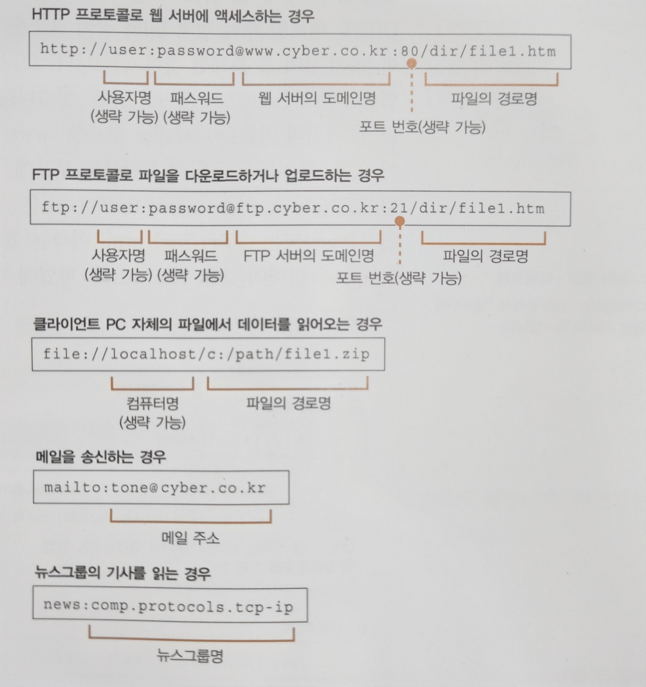
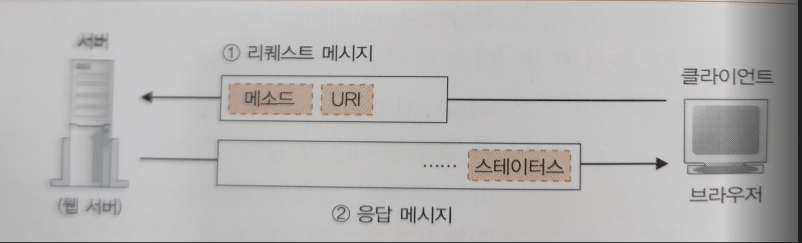
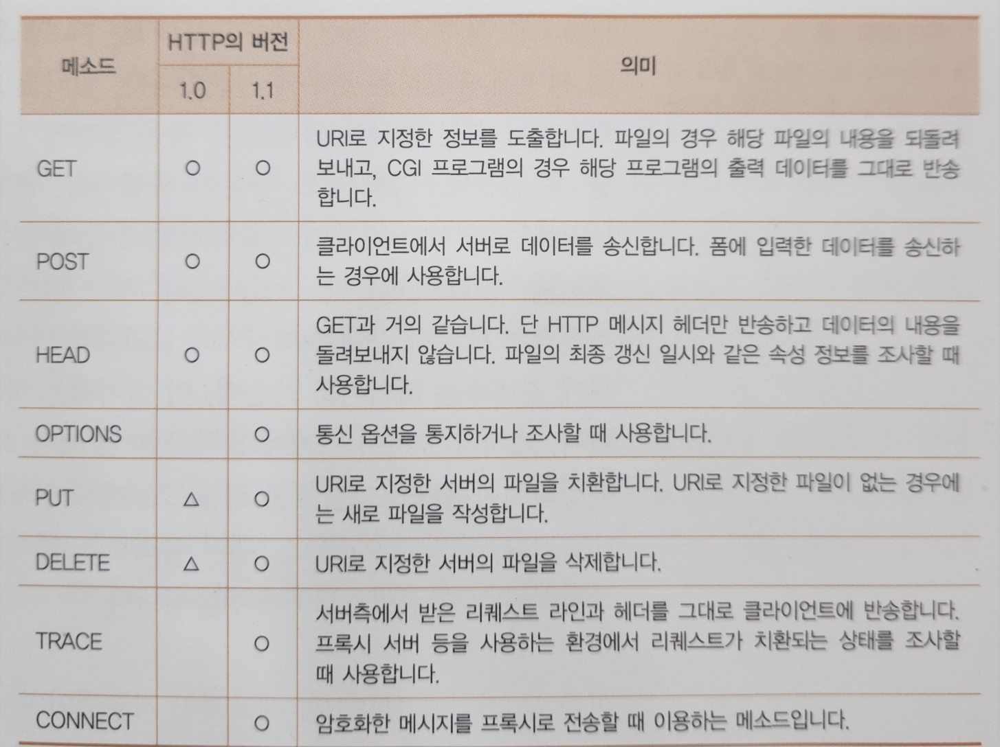
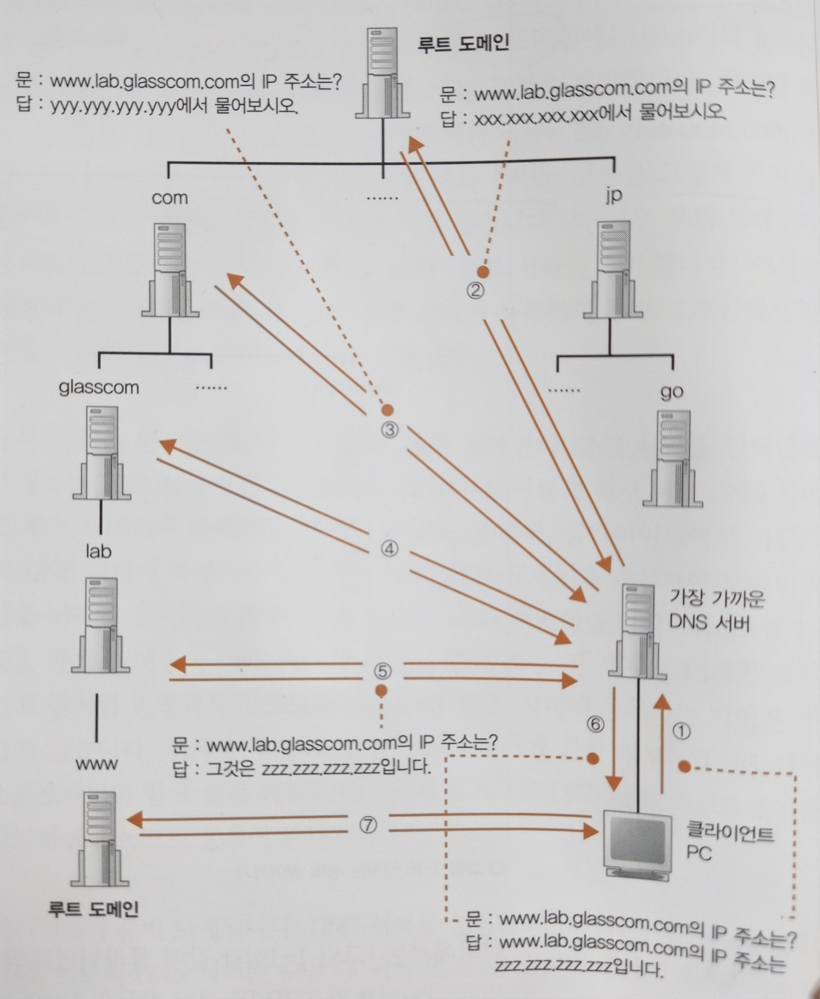
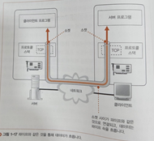

# 웹 브라우저가 메시지를 만든다
## HTTP 리퀘스트 메시지를 작성한다
### 탐험 여행은 URL 입력부터 시작한다
- 탐험 여행의 **출발점은 브라우저에서 URL을 입력하는 것으로 시작**된다.
- URL은 `http://`, `file:`, `mailto:` 등 여러가지가 있다.
- 우리는 `http://` 또는 `https://`의 웹 서버에 액세스하는 경우가 익숙하지만, 브라우저의 기능은 그뿐만이 아니다.
- 파일을 업/다운로드하는 FTP 클라이언트 기능, 메일 클라이언트의 기능 또한 갖고 있기에 **브라우저는 여러 가지의 클라이언트 기능을 갖춘 클라이언트 소프트웨어**로 볼 수 있다.
- URL은 액세스 대상에 따라서 다르게 구성된다.
    - 웹 서버 또는 FTP 서버에 접근하기 위해서는 서버 도메인명이나 접근 할 파일의 경로 등을 URL에 포함시킨다.
    - 메일은 상대 메일 주소를 URL에 포함하거나, 필요 시 사용자명이나 패스워드, 서버 측 포트 번호를 담을 수도 있다.
- 이렇게 **URL은 용도에 따라 다르게 구성**되지만, 모든 URL은 맨 앞에 **액세스 대상**을 나타내는 **프로토콜**을 갖고 있다.
    - 프로토콜은 액세스하는 방법을 나타낸다.
    - 웹 서버에 액세스하기 위해서는 http, 파일 서버는 ftp, 메일은 mailto 등 프로토콜 종류를 URL 맨 앞에 기입해야 한다.
- 각종 URL의 형식



### 브라우저는 먼저 URL을 해독한다.
- 브라우저가 처음 하는 일은 웹 서버로 보내는 리퀘스트 메시지를 작성하기 위해 URL을 해독하는 것이다.

#### 웹 서버 액세스 경우
- 예시 URL: `http://www.google.com/dir/file1.html`
- URL을 해독할 때에 요소들로 따로따로 분해하여 구분한다.
    - `http:`: 액세스 대상이 되는 프로토콜
    - `//`: 뒤로 이어지는 문자열이 서버 이름을 나타냄
    - `www.google.com`: 웹 서버 도메인명
    - `/dir/`: 디렉토리
    - `file1.html`: 액세스 할 파일명
- `www.naver.com` 웹 서버에 dir 디렉토리에 있는 file1.html에 대한 요청을 보낸 것으로 해석이 가능하다.

#### 파일명을 생략한 경우
- 만약 예시 URL에서 마지막이 `/dir/`로 끝나게 된다면 파일명을 쓰지 않고 생략한다는 것이다. (파일명 생략 가능)
- 하지만 파일명이 없다면 서버에서는 어느 파일에 접근을 해야 할지 알 수 없다.
- 따라서 서버에서는 `index.html` 또는 `default.html`이란 파일을 설정하여 파일명이 지정되지 않은 요청의 경우 해당 파일로 접근시킨다.
- URL 끝에 `/`가 생략되어 있다면, 디렉토리명을 생략하는 것이므로 지나친 생략일 수 있지만, 이러한 방법도 인정이 된다.
    - 그냥 기초 설정 파일(index)에 액세스하면 되기 때문이다.
- 다만, `www.google.com/dir` 의 URL은 웹 서버가 dir이란 파일이 있으면 파일명으로 보고, dir이란 디렉토리가 있으면 디렉토리로 해석한다.

### HTTP의 기본 개념
#### 클라이언트의 Request
- 브라우저가 URL을 해독하면, 어디에 접근해야 하는지 판별되고 그 후 브라우저는 HTTP 프로토콜을 사용하여 웹 서버에 접근한다.
- HTTP 프로토콜은 클라이언트에서 서버에 리퀘스트 메시지를 보내며, 그 안에는 **무엇을** 그리고 **어떻게**라는 내용이 쓰여있다.
    - 무엇을: 액세스 대상을 통칭하여 **URI**라고 한다.
    - 어떻게: 요청의 동작을 표현하는 수단인 **메소드(Method)** 이다.
      

#### 웹 서버의 Response
- 웹 서버는 리퀘스트 메시지를 해독하고, 요구에 따라 동작한 뒤 결과 데이터를 응답 메시지에 저장한다.
- 응답 메시지의 맨 앞에는 실행 결과인 `상태 코드`가 있다.
    - 익숙한 상태 코드로는 `200 OK`, `404 Not found`, `403 Forbidden` 등이 있다.
- 그 후 헤더 파일과 데이터가 이어지고, 이 응답 메시지를 클라이언트에게 반송하며 HTTP의 동작은 마무리된다.

#### HTTP Method

- 주로 데이터를 읽을 때 사용하는(조회) `GET` 메서드가 가장 많이 사용된다.
- 다음으로 데이터를 웹 서버에 송신하여 등록하는 경우에 `POST` 메서드를 사용한다.

### HTTP 리퀘스트 메시지를 만든다
- URL을 해독하여 웹 서버와 파일명을 바탕으로 브라우저가 HTTP 리퀘스트 메시지를 만든다.
- HTTP 메시지는 쓰는 방법, 포맷이 결정되어 있으므로 브라우저는 이 포맷에 따라 리퀘스트 메시지를 만든다.
- 리퀘스트 메시지에서 첫 번째 행은 **리퀘스트 라인**을 쓰는데, 여기서 가장 중요한 것은 맨 앞의 메소드이다.
- 리퀘스트 메시지에서 두 번째 행은 **메시지 헤더**로 날짜, 데이터 종류, 압축 형식, 캐시 정보 등의 요청에 대한 부가적인 메타 정보를 나타낸다.
- 리퀘스트 메시지에서 세 번째 행은 **메시지 본문**으로 메시지의 실제 내용이 된다.
    - 리퀘스트 메시지의 메소드가 GET인 경우에는 메소드와 URI만으로 어떤 요청인지 판단이 가능하므로, 해당 부분은 공백이 된다.
    - 다른 메소드(POST,PUT 등)의 경우 입력한 데이터 등을 메시지 본문에 기입한다.

### 리퀘스트 메시지를 보내면 응답이 되돌아온다
- 응답 메시지 포맷은 기본적으로 리퀘스트 메시지와 같으나, 첫 번째 행이 다르다.
- 요청에 대한 결과를 나타내는 **상태 코드**와 **응답 문구**를 첫 번째 행에 나타낸다.
    - 상태 코드는 숫자이며, 주로 프로그램 등에게 실행 결과를 나타낸다.
    - 응답 문구는 문장이며, 사람에게 실행 결과를 알리는 것이 목적이다.
- 리퀘스트 메시지의 URI는 하나뿐이므로, 여러 개의 파일 등에 대한 요청이 필요할 경우 각각 따로따로 요청해야 한다.

## 웹서버의 IP 주소를 DNS 서버에서 조회한다
### IP 주소의 기본
- 브라우저는 네트워크 송출 기능이 없으므로, HTTP 메시지를 웹 서버로 보내기 위해선 **OS에 의뢰**를 해야 한다.
- OS에 송신을 하기 위해선 도메인명이 아닌 상대의 **IP 주소를 명확히 지정**해줘야 한다.

#### TCP/IP
- **서브넷**은 여러 PC가 하나의 **허브**에 접속한 것이다.
- 서브넷은 **라우터**로 접속한다.
- 위 두 과정으로 네트워크가 형성되는 것이 TCP/IP 개념이다.


- 네트워크 번호를 서브넷에 할당하고, 호스트 번호를 컴퓨터에 할당하고 두 주소를 합친 것이 **IP 주소**이다.

> 1. 목표 대상의 서버까지 메시지를 운반하기 위해서는 IP 주소에 따라 대상이 어디에 있는지 판단하고 운반한다.
> 2. 송신측이 메세지를 보내면 서브넷의 **허브**가 운반하고, **가장 가까운 라우터**까지 도착한다.
> 3. 라우터가 메시지를 보낸 상대를 확인하여 다음 라우터를 판단하고, 위 과정을 수행한다.

- 위 과정이 반복되어 최종 주소까지 데이터가 도착하게 되는 원리가 TCP/IP와 IP 주소의 기본적인 개념이다.

- `10.11.12.13(IP주소본체)/255.255.255.0(넷마스크)`
- 위 IP 주소에서 각각 어느 부분이 네트워크 번호인지 호스트 번호인지 알 수가 없다.
- 넷마스크는 왼쪽에 1, 오른쪽에 0이 나열되는데, **1은 네트워크 번호**, **0은 호스트 번호**를 나타낸다.
- 호스트 번호 비트가 모두 0 또는 1이면 특별한 의미를 갖는다.
    - 모두 0: 서브넷 자체를 나타낸다.
    - 모두 1: 서브넷에 속한 기기 전체에 패킷을 보내는 브로드캐스트를 나타낸다.

### 도메인명과 IP 주소를 구분하여 사용하는 이유
- TCP/IP 네트워크는 IP 주소를 모르면 메시지를 전달할 수 없다.
- IP는 숫자로 되어 복잡하니, 그냥 도메인명으로 상대를 지정하면 되지 않는지에 대한 의견도 있지만 이는 단점이 분명하다.
    - 데이터를 함께 운반하는데, **IP 주소는 4바이트**지만 **도메인명은 최대 255바이트**까지여서 그만큼 라우터에 **부하**, 전체 과정에 **지연**이 생길 수 있다.
    - 고성능 라우터라고 하더라도 라우터 속도에는 한계가 있으며, 한계에 다다르면 데이터가 인터넷 내부에 정체될 수 있다.

- 그래서 사람은 도메인명의 식별 가능한 이름을 사용하고, 라우터는 IP 주소를 사용한다는 방법이 정착되어 있다.
- 이름을 알면 IP 주소를 알고, IP 주소를 알면 이름을 알 수 있는 원리를 **DNS**라고 한다.

### Socket 라이브러리가 IP 주소를 찾는 기능을 제공한다
- DNS는 도메인에 대한 서버의 IP 주소 조사하고 반환하는 기능을 한다.
- *DNS 클라이언트 = DNS 리졸버 = 리졸버*
- DNS의 원리로 IP 조사하는 것을 네임 리졸루션이라고 하는데, 이를 실행하는 것이 리졸버이다.
- 리졸버는 **Socket 라이브러리**에 속한 프로그램 중 하나이다.
    - Socket: OS에 포함된 네트워크 기능을 어플리케이션에서 호출하기 위해 모아놓은 라이브러리이다.

### 리졸버를 이용하여 DNS 서버를 조회한다
- 리졸버는 구현되어 있기에 간단히 호출만으로 사용이 가능하다.
    - `gethostbyname(리졸버 프로그램명) ("www.google.com")(조회 서버 도메인명)`
- 리졸버를 호출하면 DNS 서버에 조회 메시지를 보내고, DNS 서버에서 응답 메시지가 돌아온다.
- 응답 메시지 안에 IP 주소가 있으므로, 이 주소를 브라우저에서 지정한 메모리 영역에 써넣는다.
- 브라우저가 웹 서버에 메시지를 보낼 때는 이 메모리 영역에서 IP 주소를 가져다 HTTP 리퀘스트 메시지와 함께 OS에 건네어 송신을 의뢰하는 것이다.

### 리졸버 내부의 작동
- 어플리케이션에서 리졸버를 호출하면 제어권이 리졸버에게로 넘어간다.
1. DNS 서버에 송신을 위한 메시지를 만든다. *(HTTP 리퀘스트 메시지 방식과 비슷)*
2. 메시지를 DNS 서버에 보낸다.
3. 리졸버 또한 네트워크에 대해 송수신 기능이 없기 때문에 OS에 포함된 **프로토콜 스택**을 호출해 실행을 의뢰한다.

- 이처럼 컴퓨터 내부 구조는 계층이 나눠져있고 서로 역할을 분담하여 실행하고 처리한다.
- DNS 서버 또한 IP 주소가 필요하다.
    - TCP/IP 설정 항목으로 컴퓨터에 미리 설정되어 있다.

# 전 세계의 DNS 서버가 연대한다
## DNS 서버의 기본 동작
- DNS 서버의 기본 동작은 클라이언트에게 조회 메시지를 받고, 조회 내용에 대해 응답하는 역할을 한다.
- 조회 메시지에는 세 가지 정보가 포함되어 있다.
    - **이름**: 서버나 메일 배송 목적지
    - **클래스**: DNS 구조 초기 고안 시, 인터넷 외 이용을 고려하여 만들었었지만, 현재는 인터넷 외 네트워크가 없으므로 인터넷을 의미하는 **IN**으로 고정됨
    - **타입**: 이름에 어떤 타입(종류)의 정보인지 (*타입에 따라 응답이 다름*)
- DNS 서버에는 위 세 가지 정보에 대응하여 클라이언트에게 응답을 내려주기 위해 **리소스 레코드**로 미리 설정한다.

**`클라이언트의 조회 메시지` 예시**
```markdown
이름: www.lab.cyber.co.kr
클래스: IN
타입: A
```

**`리소스 레코드`를 테이블 형식으로 나타낸 예시** *(실제로는 설정파일 등에 입력되어 있음)*

| 이름                  | 클래스 | 타입  | 클라이언트에 회답하는 항목      |
|---------------------|-----|-----|---------------------|
| www.lab.cyber.co.kr | IN  | A   | 192.0.2.226         |
| cyber.co.kr         | IN  | MX  | 10 mail.cyber.co.kr |
| mail.cyber.co.kr    | IN  | A   | 192.0.2.227         |

- DNS 서버는 메시지의 이름, 클래스, 타입에 모두 일치하는 정보를 찾고, 존재하면 회답 항목을 응답한다.
- `www`는 최초 웹 구조를 만들 때 `www`로 많이 만들어서 관례가 된 것 뿐이지 규칙은 아니다.
    - 어떠한 이름이든 A 타입으로 등록하면 서버의 이름이 될 수 있음.
- IP 주소는 `A`타입, 메일 배송지 조회는 `MX` 타입을 사용한다.
- MX 타입의 경우에는 **메일 서버의 우선 순위**와 **메일 서버명** 두 항목이 등록되어 있다.
    - 예시 리소스 레코드로 응답을 받게 된다고 가정하면 `10`, `mail.cyber.co.kr` 두 가지를 응답받는다.
    - 메일 서버명이 포함되어 있으므로 IP 주소 또한 회답이 가능하다.

## 도메인의 계층
- 인터넷에는 막대한 수의 서버들이 있고, 이를 전부 하나의 DNS 서버에 관리하는 것은 불가하다.
- **분산 목적**으로 다수의 DNS 서버에 정보를 등록하고, 그들끼리 **연대**하여 어디에 정보가 있는지 찾아내는 구조이다.
- 한 대의 DNS 서버에 도메인 하나를 등록한다.
- DNS 서버에 등록된 정보에는 모든 **도메인명**의 계층 구조를 가진 이름이 붙여져있다.
- `www.lab.cyber.co.kr` 에서 `.`으로 계층을 구분하며, 오른쪽에 위치할수록 상위 계층이다.
    - `kr`이란 도메인 하위에 `co` 도메인 하위에 `cyber` 도메인 하위에 `lab` 하위에 `www`가 있는 셈이다.
- 이렇게 계층형으로 DNS 서버가 배치되고, 각 도메인 정보는 그 도메인의 DNS 서버에 등록된다.

## 담당 DNS 서버를 찾아 IP 주소를 가져온다.
- 인터넷에는 수많은 DNS 서버가 존재하기에, 아래와 같이 효율적인 DNS 서버를 찾는 방법을 고안했다.
- 하위 도메인 DNS 서버의 IP 주소를 그 상위 DNS 서버에 등록하고, 등록한 DNS 서버의 IP를 또 그 상위 DNS 서버에 등록하는 식으로 상향식으로 등록한다.
    - 상위에 DNS 서버에 가면 하위의 DNS 서버 IP 주소를 알 수 있게 된다.
- 보통의 URL은 `com`, `kr`로 끝나기에 이들이 최상위 도메인인 것 같지만, 최상위 도메인인 **루트 도메인**이 숨어있다.
- 루트 도메인은 이름이 따로 없어서 보통은 생략하며, 명시적으로 써야한다면 맨 오른쪽에 `.`을 붙이지만 보통 사용하지 않는다.



- 이처럼 위에서 아래로 DNS 서버를 따라가다 보면 원하는 DNS 서버에 도달하고, 정보를 얻을 수 있다.

## DNS 서버는 캐시 기능으로 빠르게 회답할 수 있다
- DNS 서버는 조사한 이름에 대해 **캐싱**이 가능하다.
- 조회 이름에 대한 정보가 캐시에 있다면 그 위치부터 하향식으로 찾을 수 있다.


# 프로토콜 스택에 메시지 송신을 의뢰한다
## 데이터 송수신 동작의 개요
- 웹 서버에 메시지를 송신하기 위해서는 OS 내부의 **프로토콜 스택**에 의뢰한다.
- 메시지 송신을 위해서는 Socket 라이브러리에서 프로그램 부품들을 결정된 순서대로 호출한다.


- Socket 라이브러리를이용한 데이터 송수신 동작의 그림이다.
- 컴퓨터 사이에 파이프가 보이고, 이 파이프에서 데이터가 흐르게 되는 것이다.
- 중요한건, 이러한 파이프는 처음부터 존재하는 것이 아니기에 데이터 송수신 전에 서로를 파이프로 연결해주는 동작이 필요하다는 점이다.
### 소켓
- 그림에서 본 파이프의 양 끝은 데이터의 출입구이며, 이를 **소켓**이라고 부른다.
#### 송수신 시작 과정
- 서버에서 먼저 소켓을 만들어두고, 클라이언트가 연결하기를 기다린다.
- 클라이언트 또한 소켓을 만들고 서버 측 소켓에 연결했다면 데이터 송수신 할 준비가 완료된다.
#### 송수신 종료 과정
- 데이터를 전부 보내고나면 연결했던 파이프가 분리된다.
- 파이프를 연결했을 때는 클라이언트가 서버측으로 향하게 했었지만, 종료 시에는 순서는 상관이 없다.
- 파이프가 분리되면 통신 동작이 완료된다.

```markdown
송수신 동작
(1) 소켓을 만든다.
(2) 서버측 소켓에 파이프를 연결한다.
(3) 데이터를 주고 받는다.
(4) 파이프를 분리하고 소켓을 말소한다.
```
- 앞서 이러한 동작을 수행하는 것은 **프로토콜 스택**이다.
- 브라우저 등 어플리케이션 자체에서 파잎를 연결하는 것이 아닌, **프로토콜 스택에 의뢰**해서 파이프를 연결하거나 데이터를 송수신한다.
- 소켓은 어플리케이션에서 의뢰받은 내용을 전달하는 **중개역**을 수행할 뿐 실질적인 작업을 하진 않는다.

## 소켓의 작성 단계
- DNS와 마찬가지로 Socket 라이브러리의 리졸버를 호출헀지만, 이번에는 여러 개의 프로그램 부품들을 결정된 순서대로 호출한다.
- 소켓이 생기면 **디스크립터**가 돌아와 어플리케이션이 이것을 메모리에 기록한다.
- 브라우저 내에서 여러 개의 소켓이 사용될 수 있는데, **디스크립터**는 소켓을 식별하기 위해 사용된다.

## 파이프를 연결하는 접속 단계
- 어플리케이션은 서버측의 소켓에 접속하기 위해 Socket 라이브러리의 `connect`를 호출한다.
- `connect`를 호출하기 위해선 디스크립터, 서버의 IP 주소, 포트 번호를 지정해야 한다.
    - **디스크립터**: 프로토콜 스택에 통지하고, 프로토콜 스택에서 디스크립터를 보고 어느 소켓을 서버측의 소켓에 접속할지 판단하고 접속을 수행한다.
    - **IP 주소**:송수신 상대의 IP 주소이다.
    - **포트**:IP 주소만으로는 한계가 있고, 포트 번호까지 있어야 어느 컴퓨터의 상대 소켓인지 분명히 지정할 수 있다.
        - 서버측 포트번호는 어플리케이션 종류에 따라 미리 결정되는 규칙이 있다. *(웹:80, 메일:25)*

## 메시지를 주고받는 송수신 단계
### write
- socket에서 `write` 호출 시 디스크립터와 송신 데이터를 지정하고, 프로토콜 스택이 데이터를 서버에 송신한다.
- 소켓에는 연결된 상대를 알고 있으므로 전달받은 디스크립터로 대상을 판별해 메시지를 전달한다.

### read
- 수신 응답 메시지를 저장하기 위해 메모리 영역을 지정하고, 이를 **수신 버퍼**라고 부른다.
- 응답 메시지가 오면 `read`가 받아서 수신 버퍼에 저장한다.
- 수신 버퍼에 저장한 시점에서 메시지를 어플리케이션에게 건네준다.

## 연결 끊기 단계에서 송수신이 종료된다
- `close`를 호출하여 연결을 끊도록 의뢰하면 파이프가 분리되고 소켓이 말소된다.

---
- 이것들이 HTTP의 본래 동작이며, HTTP 프로토콜은 1개의 데이터를 읽을 때마다 접속, 송수신, 연결끊기 동작을 반복한다.
- 많은 요청이 필요한 페이지의 경우에 비효율적이며 나중에는 연결을 끊지 않고 복수의 리퀘스트와 응답 주고받는 방법도 마련되었다.
    - HTTP 1.1 버전에서 사용 가능하며, 요청할 데이터가 없을 경우에 연결 끊기에 들어갈 수 있다.