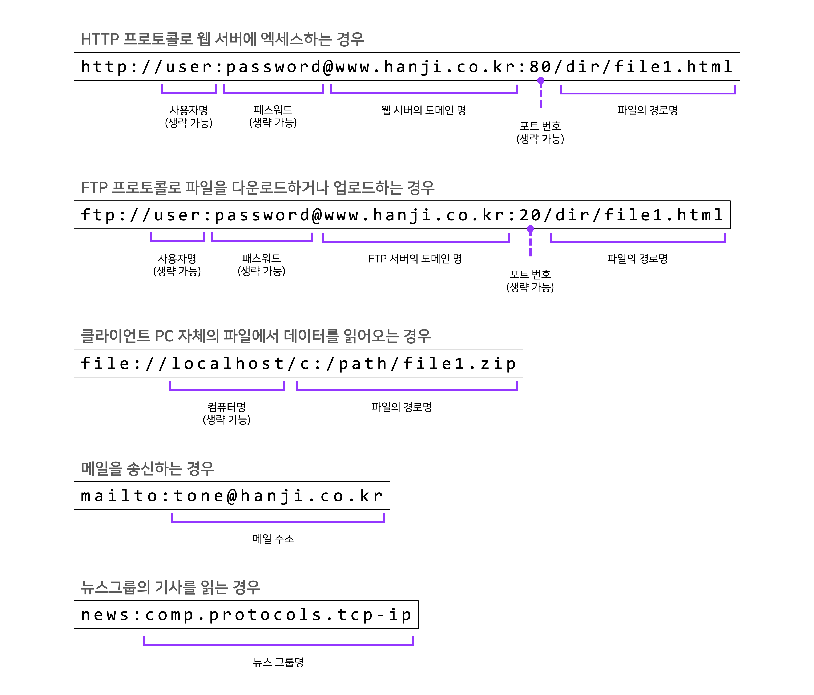
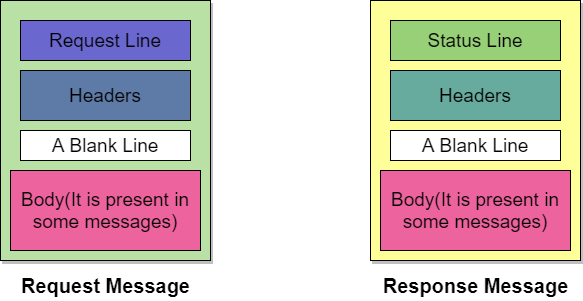

# [Chapter_01] 웹 브라우저가 메시지를 만든다.

> 성공과 실패를 결정하는 1%의 네트워크 원리를 읽고 정리한 내용입니다.  

<br>  

## 📌  개요
[1. HTTP 리퀘스트 메시지를 작성한다](#-story-1-http-리퀘스트-메시지를-작성한다)  
[2. 웹 서버의 IP 주소를 DNS 서버에 조회한다](#-story-2-웹-서버의-ip-주소를-dns-서버에-조회한다)  
[3. 전 세계의 DNS 서버가 연대한다](#-story-3-전-세계의-dns-서버가-연대한다)  
[4. 프로토콜 스택에 메시지 송신을 의뢰한다](#-story-4-프로토콜-스택에-메시지-송신을-의뢰한다)  

<br>  

### 🌐 Story 1. HTTP 리퀘스트 메시지를 작성한다  
<br>  

1️⃣  탐험 여행은 URL 입력부터 시작한다  
- 탐험 여행의 출발점은 브라우저에서 URL을 입력하는 곳이다.  
- URL(Uniform Resource Locator)은 `http://`로 시작하는 것이라고 알고있지만, 이외에도 `file:`, `mailto:`로 시작하는 것 등 여러가지가 있다.  

   ```
   URL(Uniform Resource Locator)이란?
   
   네트워크 상에서 자원이 어디 있는지를 알려주기 위한 규약이다. 
   즉, 컴퓨터 네트워크와 검색 메커니즘에서의 위치를 지정하는, 웹 리소스에 대한 참조이다. 쉽게 말해서, 웹 페이지를 찾기위한 주소를 말한다.  
   흔히 웹 사이트 주소로 알고 있지만, URL은 웹 사이트 주소뿐만 아니라 컴퓨터 네트워크상의 자원을 모두 나타낼 수 있다. 그 주소에 접속하려면 해당 URL에 맞는 프로토콜을 알아야 하고, 그와 동일한 프로토콜로 접속해야 한다.

   FTP는 FTP 클라이언트를 이용해야 하고, HTTP인 경우에는 웹 브라우저를 이용해야 한다.  텔넷의 경우에는 텔넷 프로그램을 이용해서 접속해야 한다.  

   (출처: https://ko.wikipedia.org/wiki/URL)
   ```
- 브라우저는 보통 웹 서버에 엑세스하는 클라이언트로 사용하지만, 파일을 다운로드/업로드 하는 `FTP`의 클라이언트 기능이나, `메일`의 클라이언트 기능도 가지고 있다.  
- 그렇다면 왜, URL은 다양한 기능을 제공할까?  
  + 브라우저는 몇 개의 클라이언트 기능을 겸비한 복합적인 클라이언트 소프트웨어라고 할 수 있다.  
  + 이러한 기능 중 어떤 것을 사용하여 데이터에 엑세스하면 좋을지 판단하는 재료가 필요한데, 그 재료가 `URL`이다.   
- 모든 URL에는 하나의 공통점이 있다.
  + URL의 맨 앞에 있는 문자열, 즉 `http:`,  `ftp:`, `file:`, `mailto:`라는 부분에서 엑세스하는 방법을 나타내는데, 이것들을 `프로토콜`이라고 부른다.     
</img>  
> 그림 1-1 각종 URL의 형식  

<br>   

2️⃣  브라우저는 먼저 URL을 해독한다  
- 브라우저가 처음 하는 일은 웹 서버에 보내는 리퀘스트의 메시지를 작성하기 위해 이 URL을 해독하는 것이다.
- `https://www.hanji.com/file.html` 라는 URL을 살펴보자
   + `http:`는 프로토콜  
   + `//` 뒤에 이어지는 문자열이 서버의 이름임을 나타냄  
   + `www.hanji.com`은 웹서버 이름  
   + `/file.html`은 데이터 출처의 경로  

<br>  

3️⃣  파일명을 생략한 경우
- `https://www.hanji.com/` 이런식의 URL도 본 적 있을것이다.  
   + 원래는 `/`뒤에 파일명을 적어줘야 하지만, 생략이 되어있는 경우 서버가 알아서 `index.html`또는 `default.html` 파일을 엑세스 해준다.  
   + `com` 뒤에 `/`를 생략해도 결과는 동일하다.  

<br>  

4️⃣  HTTP의 기본 개념  
- 브라우저는 URL을 해독하여 어디에 엑세스해야 하는지 판단하고, 프로토콜을 사용하여 웹 서버에 엑세스한다.
  ```
  HTTP(HyperText Transfer Protocol)란?

  HTTP는 W3 상에서 정보를 주고받을 수 있는 프로토콜이며, 주로 HTML 문서를 주고받는데 쓰인다.
  HTTP는 클라이언트와 서버 사이에 이루어지는 요청/응답(request/response) 프로토콜이다. 
  예를 들면, 클라이언트인 웹 브라우저가 HTTP를 통하여 서버로부터 웹페이지(HTML)나 그림 정보를 요청하면, 서버는 이 요청에 응답하여 필요한 정보를 해당 사용자에게 전달하게 된다. 이 정보가 모니터와 같은 출력 장치를 통해 사용자에게 나타나는 것이다.

  (출처: https://ko.wikipedia.org/wiki/HTTP)
  ```
- HTTP 프로토콜은 클라이언트와 서버가 주고받는 메시지의 내용이나 순서를 정한것이다.  
- 리퀘스트 메시지에는 `'무엇을'`, `'어떻게 해서'` 하겠다는 내용이 쓰여있다.  
- `'무엇을'`에 해당하는 것을 `URI`라고 한다.  
<br>    

  ```
  URI(Uniform Resource Identifier)

  URI(통합 자원 식별자)는 인터넷에 있는 자원을 나타내는 유일한 주소이다.
  URI의 존재는 인터넷에서 요구되는 기본 조건으로서 인터넷 프로토콜에 항상 붙어다닌다.
  URI의 하위 개념으로 URL, URN이 있다.

  (출처: https://ko.wikipedia.org/wiki/%ED%86%B5%ED%95%A9_%EC%9E%90%EC%9B%90_%EC%8B%9D%EB%B3%84%EC%9E%90)
  ```

  </img>
  > 그림 1-2 URI의 이해를 돕는 이미지  

- `'어떻게 해서'`에 해당하는 것은 `메소드(Method)`이다. 이 메소드에 의해 웹 서버에 어떤 동작을 하고싶은지 전달한다. (GET, POST, PUT 등)  
- 리퀘스트 메시지가 웹 서버에 도착하면 웹 서버는 그 속에 쓰여있는 내용을 해독한다.  
- `무엇을`, `어떻게 하는지` 판단한 후, 요구에 따라 동작하고, 결과 데이터를 응답 메시지에 저장한다.  
- 응답 메시지의 맨 앞부분에는 실행 결과를 나타내는 스테이터스 코드(Status code)가 있다.   
-  그 다음 헤더 파일과 페이지의 데이터가 이어지고, 이 응답 메시지를 클라이언트에 반송한다. (ex. 404 Not Found)
-  응답 메시지가 클라이언트에 도착하면 브라우저가 메시지의 안의 데이터를 추출하고, 화면에 송출하며 HTTP의 동작이 끝난다.  
- HTTP의 주요 메소드
   + GET : URI로 지정한 정보를 도출  
   + POST : 클라이언트에서 서버로 데이터를 송신, 폼에 입력한 데이터를 송신  
   + PUT : URI로 지정한 서버의 파일을 변경, 수정  
   + DELETE : URI로 지정한 서버의 파일을 삭제  
<br>    

5️⃣  HTTP 리퀘스트 메시지를 만든다  
- URL을 해독하고 웹 서버와 파일명을 판단하면 브라우저는 이것을 바탕으로 HTTP의 요청 메시지(Request Message)를 만든다.  
  <br>    
  </img>
  > 그림 1-3 HTTP 메세지 포맷 
  <br>    
1. Request Line  
   - 요청 메시지의 첫 번째 행에 위치한다.  
   - 메소드 : 여러 종류의 메소드 중 웹 서버에 어떻게 전달할지 메소드에 담아서 판단한다.  
      + 브라우저의 동작 상태에 따라 이 메소드가 결정된다.  
   - URI : 파일이나 경로명  
      + 보통 파일이나 프로그램의 경로명을 쓴다.  
   - HTTP 버전  
2. Headers
   - 두 번째 행부터는 메시지 헤더 행이 이어진다.  
   - 부가적인 자세한 정보를 추가한다.   
   - 날짜, 데이터 종류, 언어, 압축 형식 등   
   - 메시지 해더 뒤에 아무것도 쓰지 않은 하나의 공백 행(A Blank Line)을 넣어준다  
3. Request Body  
   - 메시지 본문은 공백 행 뒤에 위치한다.  
   - 송신할 데이터는 메시지 본문에 넣는다.  
   - 이것이 메시지의 실제 내용이 된다.  
<br>    

6️⃣  리퀘스트 메시지를 보내면 응답(Response)이 되돌아온다    
- 기본적으로 첫번째 행을 제외하고 요청 메시지와 비슷한 형태를 지닌다.  
1. Status Line  
   - Status Code  
     + 숫자로 쓰여있으며, 주로 프로그램 등에 요청 실행 결과를 알려줌  
   - 응답 문구  
     + 문장으로 쓰여있으며, 사람에게 실행 결과를 알리는 것이 목적  
2. Headers  
3. Response Body  
<br>  
- Status Code의 개요  
| code | description                        |
| ---- | ---------------------------------- |
| 1xx  | 처리의 경과 상황 등을 통지         |
| 2xx  | 정상 종료                          |
| 3xx  | 무언가 다른 조치가 필요함을 나타냄 |
| 4xx  | 클라이언트측의 오류                |
| 5xx  | 서버측의 오류                      |
> Status Code는 첫 번째 행에 개요를 나타내고, 두 번째와 세 번째 행에 상세한 상황을 나타낸다. 이 표는 첫 번째 행의 의미를 정리한 것이다.
<br>  
- 한 개의 요청에 대해 한 개의 응답만 돌려 보낸다.  
- 그래서, 한 페이지 내에 여러 컨텐츠(이미지 또는 영상 등)를 포함할 경우 각각 요청을 보내야한다.  
<br>  

### 🌐 Story 2. 웹 서버의 IP 주소를 DNS 서버에 조회한다
1️⃣  IP 주소의 기본  
2️⃣  도메인명과 IP 주소를 구분하여 사용하는 이유  
3️⃣  Socket 라이브러리가 IP 주소를 찾는 기능을 제공한다  
4️⃣  리졸버를 이용하여 DNS 서버를 조회한다  
5️⃣  리졸버 내부의 작동

### 🌐 Story 3. 전 세계의 DNS 서버가 연대한다
1️⃣  DNS 서버의 기본 동작  
2️⃣  도메인의 계층  
3️⃣  담당 DNS 서버를 찾아 IP 주소를 가져온다  
4️⃣  DNS 서버는 캐시 기능으로 빠르게 회답할 수 있다   

### 🌐 Story 4. 프로토콜 스택에 메시지 송신을 의뢰한다
1️⃣  데이터 송/수신 동작의 개요  
2️⃣  소켓의 작성 단계  
3️⃣  파이프를 연결하는 접속 단계   
4️⃣  메시지를 주고받는 송/수신 단계  
5️⃣  연결 끊기 단계에서 송/수신이 종료된다  

